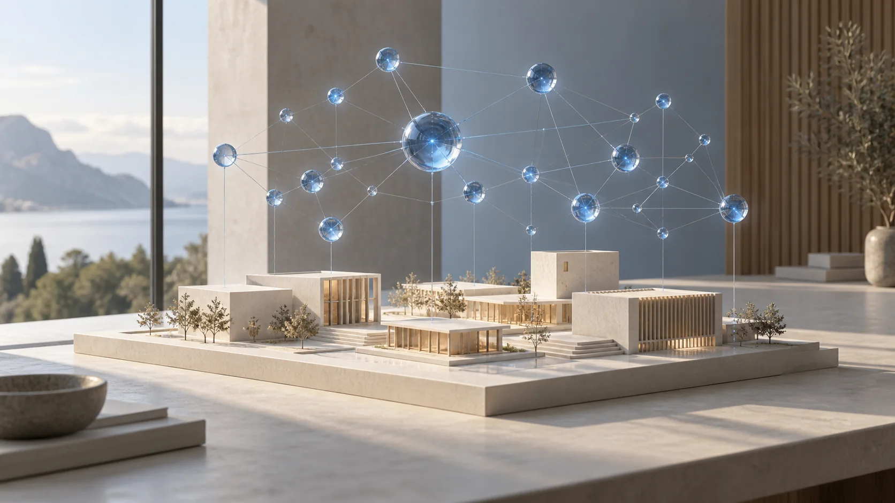

# 建筑方案变体

DESIGN VARIATIONS · X-012

> 概念占位项目，图像为示意，不代表真实委托或已建成作品。

- 分类：AI工作流
- 时间：概念示例 / 年份待填
- 个人职责：个人设计 · 角色待填写
- 工具：ComfyUI · Python · Blender

## 项目概述

固定场地边界与体量关系，仅对立面节奏、材质和光照生成受控变体。

## 设计过程

01 / 设计起点：固定场地边界与体量关系，仅对立面节奏、材质和光照生成受控变体。

02 / 方法与工具：ComfyUI · Python · Blender。在真实项目中补充采用的方法、关键参数与个人负责范围。

03 / 过程记录：在此替换调研、草图、迭代对比、空间分析或交互状态图。

04 / 交付与复核：补充最终图纸、影像、模型或实机效果，以及实际完成的验证。当前为占位方案。
